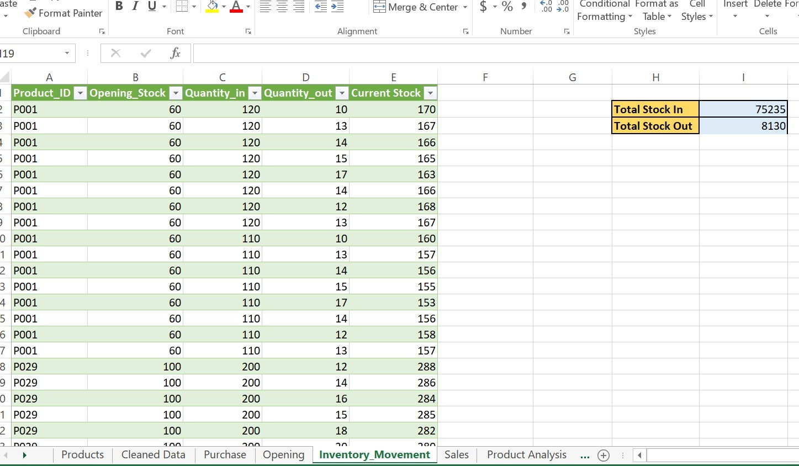
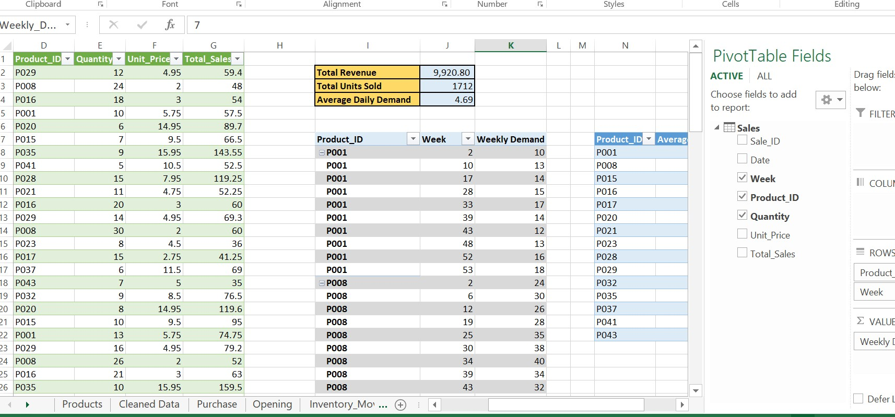
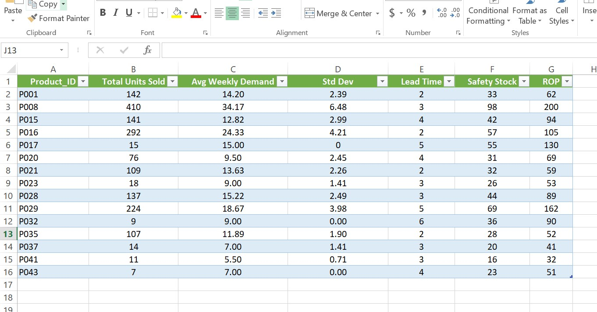

## Inventory-Demand-Forecasting-ROP-Analysis
Excel-based inventory analysis project using weekly demand data to calculate Standard Deviation, Safety Stock, and Reorder Point (ROP).
## Project Overview

This project analyzes weekly product demand using Excel to calculate:

Average Weekly Demand
Standard Deviation of Demand
Safety Stock
Reorder Point (ROP)

The objective is to support inventory decision-making by determining when to reorder products and how much safety stock is required to avoid stockouts.

This model simulates a real-world inventory control scenario used in supply chain operations.

## Tools Used
Microsoft Excel
Pivot Tables
Statistical Functions
Inventory Control Formulas
Dataset Description

## The dataset 
Opening
Purchase
Sales

## Key Calculations
1. Average Weekly Demand
   
Used to estimate expected consumption during supplier lead time.

Formula:

Average Demand = Total Units Sold ÷ Number of Demand Weeks

2. Standard Deviation

Measures demand variability and uncertainty.

Excel Function Used:

STDEV.S()

For low-frequency demand items:

Estimated using:

Std Dev ≈ 30% of Average Demand

3. Safety Stock

Calculated using service level protection against stock shortages.

Formula:

Safety Stock = Z × Std Dev × √Lead Time

Service Level Used:

95%

Z-value:

1.65

4. Reorder Point (ROP)

Determines when to place a new order.

Formula:

ROP = (Average Weekly Demand × Lead Time) + Safety Stock

## 📷 Project Preview

